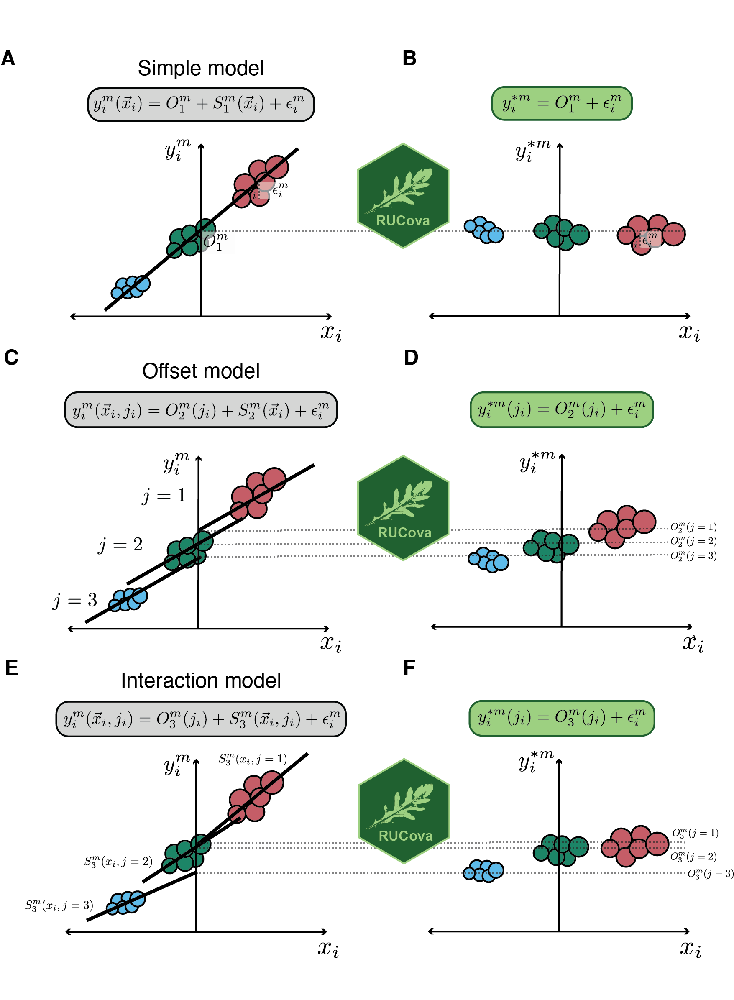

```{r, include = FALSE}
knitr::opts_chunk$set(
  collapse = TRUE,
  comment = "#>",
  warning = FALSE,
  message = FALSE
)
```

# A brief overview

Here we present the R package RUCova, a novel method designed to address confounding factors such as heterogeneous cell size and staining efficiency in mass cytometry data. RUCova removes unwanted covariance using multivariate linear regression based on Surrogates of Unwanted Covariance (SUCs), and Principal Component Analysis (PCA).

RUCova comprises two major steps:

1. First, it fits a multivariate model for each measured marker ($m$) across cells ($i$) from samples ($j_i$) with respect to the surrogates of sources of unwanted covariance (SUC, $\vec{x_i}$). Samples $j_i$ can be either different cell lines, perturbations, conditions, metacells (clusters), or even batches. 

2. Second, it eliminates such dependency by assigning the residuals $\epsilon$ of the model as the new modified expression of the marker. The fit can be expressed as:
$$ y^{m}_i(\vec{x}_{i},j_i) =  \underbrace{O^m(j_i) + S^m(\vec{x}_{i},j_i) }_{M(\vec{x}_{i},j_i)} + \epsilon^m_i\ $$, where $S^m(\vec{x}_{i},j_i)$ describes the slope of the fit and $O^m(j_i)$ the intercept or offset. 

The predictors are the surrogates of sources unwanted covariance (SUC, $\vec{x}$), which can be either specific markers as proxies of the confounding factors or the principal components (PCs) derived from a Principal Component Analysis (PCA) performed on such markers.

RUCova offers 3 different uni- or multi-variate linear models to describe the relationship between marker expression and SUC: (1) $M_1(\vec{x}_{i})$: simple, (2) $M_2(\vec{x}_i,j_i)$: offset, and (3) $M_3(\vec{x}_i,j_i)$: interaction. In this vignette you can find a detailed description of these methods and their differences.

The RUCova method eliminates the dependency of each measured marker on the SUCs by computing the model's residuals and the intercept as the revised expression for each marker ($y^{m*}_i$).:

$$ y^{*m}_i(j_i) = O_1^m(j_i) + \epsilon^m_i $$, where $\epsilon^m_i$ are the residuals of the model.


In this vignette, we guide you step-by-step through it so you can make good use this package and reliably analyse single-cell mass cytometry data.

## Citation

If you use RUCova in published research, please cite:

RUCova: Removal of Unwanted Covariance in mass cytometry data;
Rosario Astaburuaga-García, Thomas Sell, Samet Mutlu, Anja Sieber, Kirsten Lauber, Nils Blüthgen;
bioRxiv 2024.05.24.595717; 
https://doi.org/10.1101/2024.05.24.595717

# Install RUCova and import libraries

Run the following in R:

```{r, message = FALSE}
library(remotes)
remotes::install_github("molsysbio/RUCova", force = TRUE)
library(RUCova)
library(ggplot2)
library(tidyr)
library(tibble)
library(dplyr)
#library(ComplexHeatmap)
#library(circlize)
#library(Matrix)
#library(base)
theme_set(theme_classic())
```

# Input data

Let's first go through each input of RUCova.

## data

Is a tibble containing mass cytometry data of single-cell marker signals [rows = cells, columns = markers and metadata] in linear scale. This data set should be clean, meaning you excluded beads, debris, doublets, dead cells, and single-cells are demultiplexed (important if you want to adapt the linear fits to the samples).

In this example we offer a mass cytometry data set consisting of 8 Head-and-Neck Squamous Cell Carcinoma (HNSCC) lines in irradiated (10 Gy) and control (0 Gy) conditions (Figure 2 and Figure 3 in the manuscript).

```{r}
data <- RUCova::HNSCC_data
colnames(data) <- make.names(colnames(data)) #not needed here but frequently necessary
 
head(data)

```

First, we add an id per cell to be able to do a cell-wise signals value modification.

```{r}
data <- data |> mutate(cell_id = 1:n())
```

## markers

A vector of markers$m$,for which we want to regress out the unwanted covariance. In this example:

```{r}
m <- c("pH3","IdU","Cyclin_D1","Cyclin_B1", "Ki.67","pRb","pH2A.X","p.p53","p.p38","pChk2","pCDC25c","cCasp3","cPARP","pAkt","pAkt_T308","pMEK1.2","pERK1.2","pS6","p4e.BP1","pSmad1.8","pSmad2.3","pNF.κB","IκBα", "CXCL1","Lamin_B1", "pStat1","pStat3", "YAP","NICD")
```

The character variables in the vectors `x` (surrogates) and `m` (markers) must be findable as column names in the tibble `data`.

## SUCs

Since cell volume and labeling efficiency cannot be directly measured with mass cytometry, we use four \underline{S}urrogates of sources of \underline{U}nwanted \underline{C}ovariance (SUCs):  

$\vec{x}_i = [\rm{mean~DNA_i},\rm{mean~highest~BC}_i,\rm{total~ERK_i},\rm{pan~Akt_i}]$

### Mean DNA: Mean value of normalised iridium channels

$\rm{mean~DNA}_i = \frac{Ir191_{norm,i} + Ir193_{norm,i}}{2}$, where $\rm Ir191_{norm}$ and $\rm Ir193_{norm}$ are the percentile-normalised intensities (e.g., to the 95th percentile) of the iridium intercalators serving as DNA stains for each cell$i$. 

The RUCova function called `RUCova::calc_mean_DNA` applies the `asinh()` function and adjusts the transformed distributions of the iridium isotopes (Ir191 and Ir193) by matching a specific percentile `q` to take then the mean value of these two signals per cell. The function returns a vector with the mean DNA signals in linear scale, as it applies the inverse transformation `sinh()`.

```{r}
data <- data |> 
  mutate(mean_DNA = RUCova::calc_mean_DNA(DNA_191Ir, DNA_193Ir, 
                                          q = 0.95))
```

### Mean BC: Mean value of the highest (used) barcoding isotopes per cell:

$\rm{mean~highest~BC}_i = \frac{1}{N_{BC}}\sum_{k=1}^{N_{BC}}{BC_{i,k,norm}}$, where$\rm BC_{norm}$are the percentile-normalised intensities of the barcoding isotopes across all cells (\textit{e.g.,} to the 95th percentile),$\rm N_{BC}$is the number of barcoding isotopes used per cell (e.g.:$\rm N_{BC}$= 3 for the Fluidigm kit of Palladium isotopes),  and$\rm BC_k$is the barcoding isotope with the k-th highest signal in cell$i$, meaning the isotope was used in that cell to barcode it. 

The RUCova function called `RUCova::calc_mean_BC` works in two steps. First, it applies the `asinh()` function and adjusts the transformed distributions of the barcoding isotopes by matching a specific percentile `q`. Then, it looks at the signals of each isotope for each cell and picks the top `n_bc` signals used for barcoding. The function returns a vector with the mean BC signals in linear scale, as it applies the inverse transformation `sinh()`. 

In the following example the Cell-ID 20-Plex Pd Barcoding Kit was used, in addition to Platinum 194 and 198, where 4 out of 8 isotopes are mixed to form one barcode:

```{r}
data <- data |> 
  mutate(mean_BC = RUCova::calc_mean_BC(Pd102Di, Pd104Di, Pd105Di, Pd106Di, Pd108Di, Pd110Di,
                                        Dead_cells_194Pt,Dead_cells_198Pt, 
                                        n_bc = 4, 
                                        q = 0.95))
```

### pan Akt and total ERK

The surrogates pan Akt and total ERK are markers included in our mass cytometry panel. 

*The selection of SUCs should be strategically aligned with the biological system, experimental framework, and specific markers involved. In this investigation, our mass cytometry panel is primarily focused on the MAPK pathway and its interactions. Consequently, selecting total ERK and pan Akt as SUCs is deemed suitable. Nonetheless, we are aware that these markers may not always be optimal in other scenarios due to possible variations. Alternatively, markers such as metabolic enzymes like GAPDH present a viable option. Although GAPDH was not tested in our study, we recognize its importance and frequent use as a control in western blots.*

Now we define our vector of SUCs as:

```{r}
x = c("total_ERK", "pan_Akt", "mean_DNA", "mean_BC")
```

### PCA

SUCs can also be linearly transformed into a new coordinate system by applying Principal Component Analysis. By doing this, users can decide the extent of unwanted correlation to be removed by using eg.: only PC1 as a predictive variable in the univariate model, or PC1 to PC2, or all PCs equivalent to taking all surrogates as predictive variables (more examples below).

```{r}
pca <- data |> 
  select(x) |> 
  mutate_all(asinh) |> 
  mutate_all(scale) |> 
  prcomp()

```

## apply_asinh_SUCs 

Apply (`TRUE`) or not (`FALSE`) asinh transformation to the SUCs. `TRUE` if SUCs are the measured surrogates ($x$), `FALSE` if SUCs are PCs.

## model

A character: `simple`, `offset` or `interaction` defining the linear model to be used. Here we offer a quick description of each model and their rationale.

### M1: Simple 

Consists of one fit per measured marker$y^m_i$across the entire data set.

$$ M_1(\vec{x}_{i}) = \underbrace{\beta^m}_{=O_1^m} + \underbrace{\sum_{p = 1}^{N_{SUC}} \alpha^m_{p} \cdot x_{i,p}}_{=S^m_1(\vec{x}_{i})}\ $$, where $\beta_0^m$ is the intercept and $\alpha_p^m$ is the slope coefficient for each predictor or SUC $p$.

This is suitable when the data set includes one cell line/organoid/biological system with multiple perturbations, and the goal is to evaluate the treatment effect across these perturbations. We recommend this model when the relationship between marker abundance and the source of confounding factors (slope) is theoretically thought to be consistent across the data set. 


### M2: Offset 

Consists of one fit per measured marker $y^m_i$ and sample $j_i$. The fits for the samples share the same slope, while differing in the intercept (offset term $O^m_2(j_i)$). Samples $j_i$ can be either different cell lines, perturbations, conditions, metacells (clusters), or even batches. 

$$ M_2(\vec{x}_{i},j_i) = \underbrace{\beta^m_{j_i}}_{=O_2^m(j_i)} + \underbrace{\sum_{p = 1}^{N_{SUC}} \alpha^m_{p} \cdot x_{i,p}}_{=S_2^m(\vec{x}_{i})} $$

The offset - intercept - term $O^m$ can either represent desired variation between samples (`keep_offset = TRUE`) or unwanted variation (`keep_offset = FALSE`). If the offset is considered wanted, the output from the offset model will closely resemble that of the simple model. However, the offset model becomes particularly important when the variation between samples is unwanted, such as when different samples represent batches and the goal is to remove batch effects.


### M3: Interaction 


Consists of one fit per measured marker $y_i^m$ and sample $j_i$. The fits for the samples can have different slopes (interaction term $S_3^m(\vec{x_i},j_i)$) and intercepts (offset term $O_3^m(j_i)$). 

$$ M_3(\vec{x}_{i},j_i) = \underbrace{\beta^m_{j_i}}_{=O_3^m(j_i)} + \underbrace{\sum_{p = 1}^{N_{SUC}} \alpha^m_{j_i,p} \cdot x_{i,p}}_{=S_3^m(\vec{x}_{i},j_i)}\ $$

This model is ideal for datasets with different cell types (e.g., immune cells) or when comparing treatment effects across different cell lines with varying relationships between marker abundance and the source of unwanted covariance (e.g., cell size). Similarly, when removing batch effects is desired, fitting an interaction model per batch and removing the offset between fits can be effective (`keep_offset = FALSE`).

## col_name_sample 

A character indicating the column name in `data` defining each sample (cell lines, batches, treatments, etc). Clarifying examples are below. 

## center_SUCs 

A character `across_samples` or `per_sample` defining how to zero-center the SUCs.

### across samples

SUCs are zero-centered across all samples before applying the linear model. This is recommended when the relationship (e.g.: logFC) between samples is an unwanted covariance and it is thought to be affected by cell size or staining efficiency.

```{r echo=FALSE, out.width = "100%", fig.align = "center",echo=FALSE,fig.cap='RUCova models centering SUCs across samples. A,B) Simple model. C,D) Offset model. E,F) Interaction model. A,C,E) Before RUCova. B,D,F) After RUCova.'}

###[] figure legend
```

### per sample

SUCs are zero-centered per sample applying the linear model. This is recommended when the relationship (e.g.: logFC) between samples is a desired covariance and is not affected by cell size or staining efficiency (more conservative)

```{r echo=FALSE, out.width = "100%", fig.align = "center",echo=FALSE,fig.cap='RUCova models centering SUCs per sample. A,B) Simple model. C,D) Offset model. E,F) Interaction model. A,C,E) Before RUCova. B,D,F) After RUCova.'}

###[] figure legend
```


## keep_offset 

As written above, the RUCova method eliminates the dependency of each measured marker on the SUCs by computing the model's residuals and the intercept as the revised expression for each marker ($y^{m*}_i$). If the offset between samples $O^m(j_i$ is a desired covariance (e.g.: cell lines), then `keep_offset = TRUE`, and the modified value of the marker is described by:
$$ y^{*m}_i(j_i) = O_1^m(j_i) + \epsilon^m_i $$
, where $\epsilon^m_i$ are the residuals of the model.
If the offset between samples is an unwanted covariance (e.g.: batches), then `keep_offset = FALSE`, and the modified value of the marker is:
$$ y^{*m}_i(j_i) = \epsilon^m_i $$


# Zero values

RUCova fits the chosen linear model including the zero values. By removing the correlation with the SUCs, zeros will get a value accordingly. Hence, RUCova addresses the issue of zero-values in mass cytometry data by assigning non-zero values while simultaneously removing such covariance. Examples below will further clarify this point.

# Output data

The output of the function `rucova` is a list containing:

`data_reg`: data set with modified marker intensity values in linear scale.

All the input variables: `data`, `markers`, `SUCs`, `apply_asinh_SUCs`, `model`, `col_name_sample`, `center_SUCs`, `keep_offset`.

`model_formula`: the `lm` model formula applied to each marker to regress-out surrogates of sources of unwanted covariance.

`model_coefficients`: intercept $O^m(j_i)$ and slope $\alpha^m_{p}$ of the fit for surrogate $p$ and marker $m$ (and sample $j$ if applicable). This values are for dummy variables. For meaningful coefficients, refer to `effective_coefficients`.

`model_residuals`: the residuals of the fit $\epsilon^m_i$.

`adj_r2`: adjusted R-squared or coefficient of determination to evaluate the goodness of fit for each marker. It quantify the proportion of the variance in the dependent variable (marker) that is explained by the independent variables (surrogates) in the model. The adjusted R-squared is adjusted by the number of independent variables used to predict the target variable. This is done to account for the automatic increase of $R^2$ values when extra explanatory variables are added to the model. By analysing the $\rm{R^2_{adj}}$,we can determine whether adding new variables increases the model fit.
$$ R_{adj}^2 = \Big(1 - \underbrace{(1-\frac{SS_{res}}{SS_{tot}}}_{R^2})\Big)\cdot\frac{n-1}{n-q-1} $$

where $SS_{res} = \sum_i \epsilon_i^2$ is the residual sum of squares,$\epsilon_i$ are the residuals of the model, $SS_{tot} = \sum_i(y_i - \overline{y})$ is the total sum of squares, $\overline{y}$ is the mean value of the marker,$n$is the sample size (total number of cells $i$) and $q$ is the number of explanatory variables in the model.

`stand_slopes`: We standardised the slope coefficients in order to make them comparable. In the case of the interaction model, where the slopes $\alpha^m$ depend on samples $j_i$ and the SUC $p$, we standardised the slope by multiplying it by the standard deviation of the corresponding SUC in each sample $j$ ( $\sigma_{x_{j_i,p}}$ ) and dividing it by the standard deviation of the marker $m$ in sample $j$ ($\sigma_{y^m_{j_i}}$) :
$$\alpha^{m*}_{j_i,x_{i,p}} = \alpha^m_{j_i,x_{i,p}}\cdot \frac{\sigma_{x_{j_i,p}}}{\sigma_{y^m_{j_i}}}$$


# Examples


## M1: Simple model

As we have multiple cancer cell lines in the current data set, we run the simple model in only one cell line and across control and treated condition.

```{r}
data_Cal33 <-  data |> filter(line == "Cal33")
```

Let's give a look at the pearson correlation coefficients between markers before applying RUCova (symmetric matrix):

```{r, fig.height=10, fig.width=10}
corr_cal33 <- data_Cal33 |>
  mutate_at(vars(m,x), asinh) |> 
  select(m,x) |> 
  cor(method= "pearson")

RUCova:: heatmap_compare_corr(corr_cal33,corr_cal33) #same in lower and upper triangle
```

### Remove correlations

#### with all surrogates, maintaing the logFC between treated and control

Let's say you're not convinced yet by the package, so you want to be conservative and remove correlations to all SUCs but not the logFC between conditions. In this case, `center_SUCs = "per_sample"`.

```{r echo=FALSE}

simple_all_x_persample <-  RUCova::rucova(data = data_Cal33, # marker intensity values in linear scale
                                markers = m,
                                SUCs = x, 
                                apply_asinh_SUCs = TRUE, #when taking surrogates we need to asinh-transform them
                                model = "simple",
                                center_SUCs = "per_sample",
                                col_name_sample = "dose")

data_reg_simple_all_persample <- simple_all_x_persample$data_reg #output of marker intensity values are also in linear scale, linear in -> linear out
```

Lower triangle: before RUCova, upper triangle: after RUCova

```{r, fig.height=10, fig.width=10}

heatmap_compare_corr(lower = data_Cal33 |>
                                mutate_at(vars(m,x), asinh) |> 
                                group_by(dose) |>
                                mutate(across(all_of(x), ~ .x - mean(.x))) |>
                                ungroup() |> 
                                select(m,x) |> 
                                cor(method= "pearson") ,
                     
                     upper = data_reg_simple_all_persample |>
                                mutate_at(vars(m,x), asinh) |> 
                                group_by(dose) |>
                                mutate(across(all_of(x), ~ .x - mean(.x))) |>
                                ungroup() |> 
                                select(m,x) |> 
                                cor(method= "pearson")) # lower triangle is before RUCova, upper is after RUCova
```

Log fold-changes between irradiated and control condition are kept (positive means higher in irradiated).

```{r, fig.height=10, fig.width=10}
data_Cal33 |> 
  mutate_at(vars(x,m), asinh) |> 
  pivot_longer(names_to = "marker", values_to = "value", c(x,m)) |> 
  group_by(marker) |> 
  summarise(logFC = mean(value[dose=="10Gy"])-mean(value[dose=="0Gy"])) |> 
  mutate(data = "before RUCova") |> 
  rbind(
    
    data_reg_simple_all_persample |> 
    mutate_at(vars(x,m), asinh) |> 
    pivot_longer(names_to = "marker", values_to = "value", c(x,m)) |> 
    group_by(marker) |> 
    summarise(logFC = mean(value[dose=="10Gy"])-mean(value[dose=="0Gy"])) |> 
    mutate(data = "simple all, per sample")
    
    
  ) |> 
  ggplot(aes(x = logFC, y = marker, fill = data)) + 
  geom_col(position = "dodge")

```

#### with all surrogates, changing logFC between samples accordingly

As radiation changes the cell volume, we think differences in protein intensities between treated and control are confounded. Hence, we want to remove any difference that correlates with the SUCs (`center_SUCs = "across_sample"`).


```{r echo=FALSE}

simple_all_x_across <-  RUCova::rucova(data = data_Cal33, # marker intensity values in linear scale
                                markers = m,
                                SUCs = x, 
                                apply_asinh_SUCs = TRUE, #when taking surrogates we need to asinh-transform them
                                model = "simple",
                                center_SUCs = "across_samples")

data_reg_simple_all_across <- simple_all_x_across$data_reg #output of marker intensity values are also in linear scale, linear in -> linear out
```

Lower triangle: before RUCova, upper triangle: after RUCova

```{r, fig.height=10, fig.width=10}

heatmap_compare_corr(lower = data_Cal33 |>
                                mutate_at(vars(m,x), asinh) |> 
                                select(m,x) |> 
                                cor(method= "pearson") ,
                     
                     upper = data_reg_simple_all_across |>
                                mutate_at(vars(m,x), asinh) |> 
                                select(m,x) |> 
                                cor(method= "pearson")) # lower triangle is before RUCova, upper is after RUCova
```

Log fold-changes between irradiated and control condition are modified accordingly (positive means higher in irradiated).

```{r, fig.height=10, fig.width=10}
data_Cal33 |> 
  mutate_at(vars(x,m), asinh) |> 
  pivot_longer(names_to = "marker", values_to = "value", c(x,m)) |> 
  group_by(marker) |> 
  summarise(logFC = mean(value[dose=="10Gy"])-mean(value[dose=="0Gy"])) |> 
  mutate(data = "before RUCova") |> 
  rbind(
    
    data_reg_simple_all_across |> 
    mutate_at(vars(x,m), asinh) |> 
    pivot_longer(names_to = "marker", values_to = "value", c(x,m)) |> 
    group_by(marker) |> 
    summarise(logFC = mean(value[dose=="10Gy"])-mean(value[dose=="0Gy"])) |> 
    mutate(data = "simple all, across samples")
    
    
  ) |> 
  ggplot(aes(x = logFC, y = marker, fill = data)) + 
  geom_col(position = "dodge")

```

#### with PC1 only

Let's imagine you want to be conservative and only remove correlations between markers and PC1 (of SUCs).

######  PCA

```{r}
pca_cal33 <- data_Cal33 |>
  select(x) |>
  mutate_all(asinh) |>
  mutate_all(scale) |>
  prcomp()
```

Calculate and plot the variance explained by each PC:

```{r}
tibble(perc = as.numeric(pca_cal33$sdev^2/sum(pca_cal33$sdev^2))*100,
       PC = 1:length(pca_cal33$sdev)) |>
  ggplot(aes(x = PC, y = perc, label = round(perc,1))) +
  geom_col() +
  geom_label()
```

Check the loadings of each PC:

```{r, fig.width=15, fig.height=5}
as.data.frame(pca_cal33$rotation) |>
  rownames_to_column("x") |>
  pivot_longer(names_to = "PC", values_to = "loadings", -x) |>
  ggplot(aes(x = loadings, y = x)) +
  geom_col() +
  facet_wrap(~PC, nrow = 1)
```

Add the PCs to the main data frame:

```{r}
data_Cal33 <- data_Cal33 |>
        cbind(as.data.frame(pca_cal33$x))
```

In this example, PC1 has negative loadings. We will just change the direction of these loadings so PC1 positively correlates with the SUCs:

```{r}
data_Cal33 <- data_Cal33 |> mutate(PC1 = -PC1)
```

Then, `SUCs= "PC1"` and `apply_asinh_SUCs = FALSE`, as asinh transformation is not necessary on PCs (it was applied on SUCs before PCA). This applies to all models.


```{r echo=FALSE}

simple_pc1_x <-  RUCova::rucova(data = data_Cal33, # marker intensity values in linear scale
                                markers = m,
                                SUCs = "PC1", # PC1 as predictive variables
                                apply_asinh_SUCs = FALSE, #when taking surrogates we need to asinh-transform them
                                model = "simple",
                                center_SUCs = "across_samples")

data_reg_simple_pc1 <- simple_pc1_x$data_reg #output of marker intensity values are also in linear scale, linear in -> linear out
```

Lower triangle: before RUCova, upper triangle: after RUCova

```{r, fig.height=10, fig.width=10}

heatmap_compare_corr(lower = data_Cal33 |>
                                mutate_at(vars(m,x), asinh) |> 
                                select(m,x,"PC1","PC2","PC3","PC4") |> 
                                cor(method= "pearson") ,
                     
                     upper = data_reg_simple_pc1 |>
                                mutate_at(vars(m,x), asinh) |> 
                                select(m,x,"PC1","PC2","PC3","PC4") |> 
                                cor(method= "pearson")) # lower triangle is before RUCova, upper is after RUCova
```

Log fold-changes between irradiated and control condition are modified accordingly (positive means higher in irradiated).

```{r, fig.height=10, fig.width=10}
data_Cal33 |> 
  mutate_at(vars(x,m), asinh) |> 
  pivot_longer(names_to = "marker", values_to = "value", c(x,m)) |> 
  group_by(marker) |> 
  summarise(logFC = mean(value[dose=="10Gy"])-mean(value[dose=="0Gy"])) |> 
  mutate(data = "before RUCova") |> 
  rbind(
    
    data_reg_simple_pc1 |> 
    mutate_at(vars(x,m), asinh) |> 
    pivot_longer(names_to = "marker", values_to = "value", c(x,m)) |> 
    group_by(marker) |> 
    summarise(logFC = mean(value[dose=="10Gy"])-mean(value[dose=="0Gy"])) |> 
    mutate(data = "simple all, across samples")
    
    
  ) |> 
  ggplot(aes(x = logFC, y = marker, fill = data)) + 
  geom_col(position = "dodge")

```


## M2: Offset model 

<!-- #### Fit  -->

<!-- Consists of one fit per measured marker$y^m_i$and sample$j_i$. The fits for the samples share the same slope, while differing in the intercept (offset term$O^m_2(j_i)$). Samples$j_i$can be either different cell lines, perturbations, conditions, metacells (clusters), or even batches.  -->

<!--$  M_2(\vec{x}_{i},j_i) = \underbrace{\beta^m_{j_i}}_{=O_2^m(j_i)} + \underbrace{\sum_{p = 1}^{N_{SUC}} \alpha^m_{p} \cdot x_{i,p}}_{=S_2^m(\vec{x}_{i})}\$-->

<!-- The offset - intercept - term$O^m$for different samples can be wanted or unwanted. For the first case, the new, modified abundance of the marker after applying RUCova is independent of$\vec{x}_{i}$and can be expressed as: -->

<!-- ### Rationale -->

<!-- When it is essential to maintain fold changes between conditions while removing correlations within each condition, the offset model is appropriate on SUCs centered by condition. This approach is particularly useful when analyzing multiple conditions where the slope may remain consistent, but the intercept may vary. This model  -->

## M3: Interaction model


<!-- Consists of one fit per measured marker$y_i^m$and sample$j_i$. The fits for the samples can have different slopes (interaction term$S_3^m(\vec{x_i},j_i)$) and intercepts (offset term$O_3^m(j_i)$).  -->
<!--$M_3(\vec{x}_{i},j_i) = \underbrace{\beta^m_{j_i}}_{=O_3^m(j_i)} + \underbrace{\sum_{p = 1}^{N_{SUC}} \alpha^m_{j_i,p} \cdot x_{i,p}}_{=S_3^m(\vec{x}_{i},j_i)}\$-->


<!-- Let's imagine you want to be conservative and only remove correlations between markers and PC1 (of SUCs). Then, `SUCs= "PC1"` and `apply_asinh_SUCs = FALSE`, as asinh transformation is not necessary on PCs (it was applied on SUCs before PCA). We will choose the interaction model (`model = "interaction"`), as the data set contains different cell lines (samples), and for each one, we want to allow different slopes and intercepts between marker expression and SUCs (or PCs (`col_name_sample = "line"`). Differences in marker expression between cell lines can be artificially influenced by e.g.: different cell volumes leading to an unwanted covariance. To remove these artefactual differences in marker expression we center the surrogates across samples for the linear fit (`center_SUCs = "across_samples"`). In case is desirable to keep the remaining offset between the cell lines, we set ` keep_offset = TRUE`.  -->

<!-- ```{r} -->
<!-- rucova_pc1 <-  RUCova::rucova(data,  -->
<!--                               markers, -->
<!--                               SUCs = "PC1", -->
<!--                               apply_asinh_SUCs = FALSE, -->
<!--                               model = "interaction", -->
<!--                               col_name_sample = "line", -->
<!--                               center_SUCs = "across_samples", -->
<!--                               keep_offset = TRUE) -->
<!-- data_reg_pc1 <- rucova_pc1$data_reg -->
<!-- ``` -->

<!-- To remove the covariance driven by all PCs (in this example, 4): -->

<!-- ```{r} -->
<!-- rucova_all <-  RUCova::rucova(data,  -->
<!--                               markers, -->
<!--                               SUCs= c("PC1","PC2","PC3","PC4"), -->
<!--                               apply_asinh_SUCs = FALSE, -->
<!--                               model = "interaction", -->
<!--                               col_name_sample = "line", -->
<!--                               center_SUCs = "across_samples", -->
<!--                               keep_offset = TRUE) -->
<!-- data_reg_all <- rucova_all$data_reg -->
<!-- ``` -->

<!-- ### Modified marker values -->

<!-- The RUCova method eliminates the dependency of each measured marker on the SUCs by computing the model's residuals and the intercept as the revised expression for each marker ($y^{m*}_i$).  -->

<!--$   y^{*m}_i(j_i) = O^m(j_i) + \epsilon^m_i$-->

<!-- ## 4. Evaluate the benefit of RUCova -->

<!-- We recommend calculating the Pearson correlation coefficients between markers and SUCs before RUCova and after RUCova, and comparing. In this example, we applied the interaction model, meaning that the unwanted correlations driven by SUCs will be removed per cell line. For this reason, we check the correlation coefficients per cell line. Let's have a look at the Cal33 cell line:  -->

<!-- ```{r} -->
<!-- corr_reg_before <- data |> filter(line == "Cal33") |>  -->
<!--   mutate_at(vars(markers,surrogates), asinh) |>  -->
<!--   select(markers,surrogates,PC1,PC2,PC3,PC4) |>  -->
<!--   cor(method= "pearson") -->

<!-- corr_reg_all <- data_reg_all |> filter(line == "Cal33") |>  -->
<!--   mutate_at(vars(markers,surrogates), asinh) |>  -->
<!--   select(markers,surrogates,PC1,PC2,PC3,PC4) |>  -->
<!--   cor(method= "pearson") -->
<!-- ``` -->

<!-- Here, ```corr_reg_before```and ```corr_reg_all``` should be square matrices containing the Pearson correlation coefficient between markers and surrogates. Row and column names of the matrices should be the corresponding markers and surrogates. Correlation coefficients can be calculated across the entire data set (if simple model was applied) or filtered by each sample if desired (if interaction model was applied). -->

<!-- Using the RUCova function ```heatmap_compare_corr()``` we can generate a square heatmap with the correlation coefficients before RUCova in the lower triangle (first argument) and after RUCova in the upper triangle (second argument) for a direct comparison: -->

<!-- ```{r, fig.height=10, fig.width=10} -->
<!-- library(Matrix) -->
<!-- library(ComplexHeatmap) -->
<!-- library(circlize) -->

<!-- RUCova::heatmap_compare_corr(lower = corr_reg_before, upper = corr_reg_all) -->
<!-- ``` -->
<!-- To further evaluate the benefit of RUCova, we recommend to also perform your favorite analysis on the data before RUCova and also after RUCova, and then compare both. This can be: density plots of marker intensity signals, UMAPs, heatmap of fold-changes, Louvain clustering, etc.  -->


